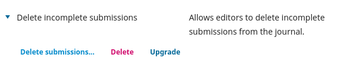
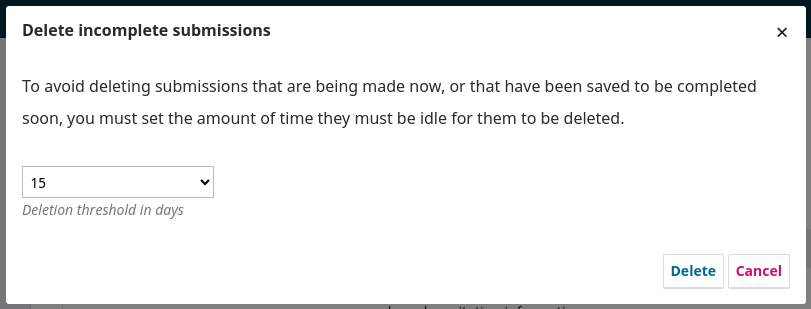

# Delete incomplete submissions

This plugin allows editors to delete incomplete submissions from the journal.

It allows the editor to set a threshold, in days, to safeguard the deletion of submissions that are not meant to be deleted at the moment.

# Compatibility

This plugin is compatible with the following PKP applications:

- OJS 3.4.0
- OPS 3.4.0

For compatibility with other versions of OJS/OPS, please refer to this repository branches.

# Installation

Download the `deleteIncompleteSubmissions.tar.gz` package under the '[Releases](https://github.com/lepidus/deleteIncompleteSubmissions/releases)' tab of this repository.

Upload the package in the `Website > Plugins` section of the Dashboard.

# Usage

After installing the plugin, it will appear in the plugins list, from there, activate the plugin, then expand the options in the arrow, and click on the ***`Delete submissions...`*** action:

From the open modal, editors will be able to delete incomplete submissions from the journal, and set a deletion threshold, in days, to safeguard the deletion of submissions that are not meant to be deleted at the moment:

# License

This plugin is licensed under the GNU General Public License v3. Read the complete [LICENSE file](LICENSE).

*Copyright (c) 2024 Lepidus Tecnologia*
