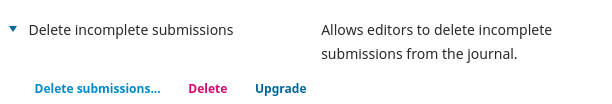
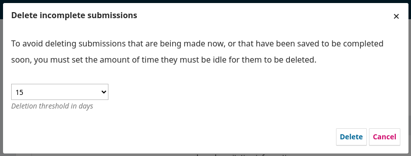

# Delete incomplete submissions

This plugin allows editors to delete incomplete submissions from the journal.

The plugin uses a fail-safe policy. A submission is only eligible when it is still queued and incomplete, has been inactive for longer than the configured threshold, and has no published or scheduled publication and no assigned DOI. These conditions are checked again immediately before deletion.

# Compatibility

This plugin is compatible with the following PKP applications:

- OJS 3.3.0
- OPS 3.3.0

# Installation

Download the `deleteIncompleteSubmissions.tar.gz` package under the '[Releases](https://github.com/lepidus/deleteIncompleteSubmissions/releases)' tab of this repository.

Upload the package in the `Website > Plugins` section of the Dashboard.

# Usage

After installing the plugin, it will appear in the plugins list, from there, activate the plugin, then expand the options in the arrow, and click on the `Delete submissions...` option:

From the open modal, editors can set a deletion threshold in days and generate a preview containing the ID, title, status, and last activity date of every eligible submission:

Deletion requires a second, explicit confirmation. Only submissions shown in the preview are considered, and each one is reloaded and revalidated before the irreversible operation. The preview expires after 15 minutes, when the threshold changes, or when a newer preview is generated for the same journal.

# License

This plugin is licensed under the GNU General Public License v3. Read the complete [LICENSE file](LICENSE).

*Copyright (c) 2024 Lepidus Tecnologia*
